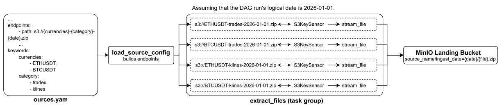

# **ZIP-Data-Pipeline**
The ELT pipeline that ingests ZIP files from S3 buckets, decompresses them, and builds data marts from the files within them.


## **Tech Stack**
- **Orchestration:** [Apache Airflow](https://airflow.apache.org/).
- **Processing:** [Apache Spark](https://spark.apache.org/docs/latest/), [PyArrow](https://arrow.apache.org/docs/python/index.html).
- **Data Lake:** [MinIO](https://docs.min.io/aistor/), [Apache Iceberg](https://iceberg.apache.org/).
- **Data Warehouse:** [ClickHouse](https://clickhouse.com/).
- **Infrastructure:** [Docker](https://www.docker.com/).
- **Tests & CI:** [Pytest](https://docs.pytest.org/en/stable/), [GitHub Actions](https://docs.github.com/en/actions).

## **Workflow**

### **Ingestion**
The ingestion layer is represented by the (<code>[ingest_from_s3](airflow/dags/ingestion.py)</code>) DAG that extracts data from S3 buckets daily, and saves it to the MinIO Landing bucket. 



[All data sources should be defined in a single YAML file](settings/README.md) (`settings/sources.yaml` by default). This is the main interface for adding, modifying, and managing sources. Each entry configures the data's location, authentication, DAGs that are allowed to work with the source, and dynamic endpoint construction. A single source can feed multiple DAGs independently, and each source is validated individually to ensure that malformed configurations never break the rest of the pipeline.

<div style="height: 16px;"></div>

There are three tasks in <code>ingest_from_s3</code>. The second and third tasks are combined into the task group (`extract_files`) to create a 1-1 mapping. One instance of this task group is created per source/endpoint combination, so each instance handles exactly one (bucket, key) pair:

1. The first task (`load_sources_config`) loads formatted sources by dag_id from the sources configuration YAML file. The date is passed as ds (the DAG logical date).  

2. The second task (`wait_for_file`) uses `S3KeySensor` to wait for the endpoint to be available.

3. The third task (`stream_file`) streams a file from a source S3 bucket into the Landing bucket in chunks using boto3. It also checks the uploaded object's size against the size on the source platform and deletes it if the sizes mismatch. Builds the following landing key: `bucket/source_name/dataset_name/ingest_date=year-month-day/file_name`.
   > *Note:* This task can be replaced by `S3CopyObjectOperator` if AWS S3 is used instead of MinIO.

<div style="height: 16px;"></div>

### **Bronze (in-progress)**
<p>The main goal of the Bronze layer is to decompress raw extracted ZIP files in chunks, append metadata columns, validate each file's schema, and load them into the Bronze bucket as Parquet.</p>
<p>Bronze transformation uses PyArrow as the main engine. Each file is transformed in a dedicated Docker container.
This approach was chosen because ZIP files are unsplittable, so Spark cannot split and process a single ZIP file across its cluster. By combining Docker and PyArrow instead, the bronze layer achieves fast, lightweight processing while completely avoiding Spark overhead.</p>

#### **The bronze_zip_to_parquet DAG**


The [Bronze DAG](airflow/dags/bronze.py) uses Asset-Aware Scheduling, triggering automatically whenever the Landing asset is updated. There are two tasks, and the second is dynamically mapped so that each triggering asset event is processed independently:

1. The first task (`load_bronze_config`) reads the triggering asset events for the Landing asset out of the task context and builds one environment-variable dictionary per landed file, containing the landing bucket, landing key, dataset name, destination (Bronze) bucket, and the DAG run id.
2. The second task (`bronze_transformation`) is a dynamically mapped `DockerOperator` that spins up one Docker container per config entry produced by the first task, passing each dictionary in as environment variables. Each container runs the bronze entrypoint module, decompresses the corresponding ZIP file in chunks, validates its schema, adds metadata columns, and writes the result as Parquet into the Bronze bucket (read the next part for more details). Containers run on the default docker-compose network.

#### **Bronze Transformation**
Each container runs through the [bronze entrypoint](./src/bronze/entrypoint.py). Bronze transformation can be divided into the following steps:

<p align="center">
  
</p>

**1. Context Reading.** The following environment variables are read:

- `landing_bucket` – the bucket with the target ZIP file.
- `landing_key` – the target ZIP file key inside `landing_bucket`.
- `dataset_name` – used to look up the expected schema (a `pyarrow.Schema` object) for the files inside the target ZIP file.
- `destination_bucket` – the bucket to write final Parquet files.
- `AWS_ENDPOINT` (optional) – the S3 endpoint URL, for example a MinIO address.

The values of the metadata columns are also built here. They are added to every file in the ZIP in step 4:

- `_dag_run_id` – the Bronze DAG `run_id`, which is passed by the DAG as an environment variable.
- `_bronze_processed_at` – the UTC time when the columns were built, in milliseconds.
- `_zip_file_name` – the name of the target ZIP file, taken from `landing_key`.

**2. `get_s3_object_iterator`:** Creates an iterator over the target ZIP file inside S3 for the given `landing_bucket` and `landing_key` using a boto3 client. The iterator returns the object in 16 MB chunks, so the ZIP file is never downloaded as a whole.

**3. `get_unarchived_stream`:** Initializes an unarchived stream, creating a wrapper around the iterator over a ZIP file. It yields a reader for each file inside the archive together with the file's schema validation status.

Processes the archive in chunks without loading it into memory. Each decompressed file is wrapped into a file-like object and opened by its extension as a `pyarrow.RecordBatchReader`. Files with unsupported extensions are skipped with a warning. The reader depends on the file type:

- `CSV` – streamed in chunks. Every column is read as string.
- `JSON` – loaded fully into memory. A file larger than `MAX_JSON_SIZE_BYTES` fails the container. A single JSON object is read as one record. All numeric data is read as string, nested structures stay nested.

The file schema is then compared with the expected schema. They must be identical: the same field names, order and types, including nested JSON structures. The status is `verified` if they match and `unverified` otherwise. Unverified files are not dropped, they are written under a separate `schema_status=unverified` key.

**4. `add_columns_to_unarchived_stream`:** Creates a wrapper to append the metadata columns to each batch of the reader. Each value is repeated for every row of the batch. Besides the three columns from step 1, it adds `_source_file_name` (the name of the file inside the ZIP) and `_validation_status` as a column.

**5. <code>upload_unarchived_zip_stream_to_s3</code>:** Uploads the decompressed files as Parquet to the <code>destination_bucket</code>. All the output of a ZIP lives under its bronze key, split by the validation status from step 3:
<p><code>source_name/dataset_name/ingest_date=.../zip_name={zip_stem}/schema_status=.../{member_file_name}_part-*.parquet</code></p>
<p>where <code>zip_stem</code> is the ZIP file name without the extension and <code>member_file_name</code> is the name of the file inside the ZIP. The row limits are in <code>pipeline_config.py</code>.</p>
<p>Before writing, the bronze key of the ZIP is wiped (the <code>_SUCCESS</code> marker first), so a re-run never produces duplicates. Once all files are written, an empty <code>zip_name={zip_stem}/_SUCCESS</code> marker shows that the ZIP was fully transformed. A ZIP without files with data writes nothing, not even the marker.</p>


### **Silver (planned)**
Spark handles splittable Parquet files from the Bronze bucket. It cleans, transforms, and writes them as Apache Iceberg tables into the Silver bucket.

<div style="height: 16px;"></div>

### **Gold (planned)**
Spark handles Apache Iceberg tables from the Silver bucket, builds data marts using denormalization, and loads the result to ClickHouse.

<div style="height: 16px;"></div>

## **Project Structure**

```
.
├── airflow/
│   ├── config/                          # airflow.cfg 
│   ├── dags/
│   │   ├── bronze.py                    # Bronze layer DAG
│   │   └── ingestion.py                 # Ingestion DAG
│   └── logs/
├── docker/                              # Custom Dockerfiles and image requirements
├── settings/
│   ├── schemas/
│   │   └── bronze_schemas.py            # Bronze layer schema definitions
│   ├── README.md
│   ├── airflow_assets.py                # Airflow asset definitions
│   ├── pipeline_config.py               # Main project configurations
│   └── sources.yaml
├── src/
│   ├── bronze/
│   │   ├── context.py                   # Bronze run context
│   │   ├── entrypoint.py                # Entrypoint for bronze containers
│   │   ├── io_wrapper.py                # File-like wrapper for iterators
│   │   ├── readers.py                   # Unarchived files readers
│   │   └── unarchive_zip.py             # Unarchivation logic
│   ├── ingestion/
│   │   ├── read_sources.py              # sources.yaml readers
│   │   └── upload_dataset.py
│   ├── spark_jobs/
│   └── utils/                           # Shared helpers
│       └── build_layer_key.py
├── tests/
│   ├── dag_tests/
│   ├── integration_tests/
│   └── unit_tests/
└── docker-compose.yaml                  # Infrastructure setup
```

## **Docker Services**
| Service | URL | Login |
| --- | --- | --- |
| Airflow UI | `http://localhost:8080` | `AIRFLOW_USERNAME` / `AIRFLOW_PASSWORD` |
| MinIO Console | `http://localhost:9002` | `AWS_ACCESS_KEY_ID` / `AWS_SECRET_ACCESS_KEY` |
| Spark Master UI | `http://localhost:8090` | — |
| Spark History Server | `http://localhost:18080` | — |

