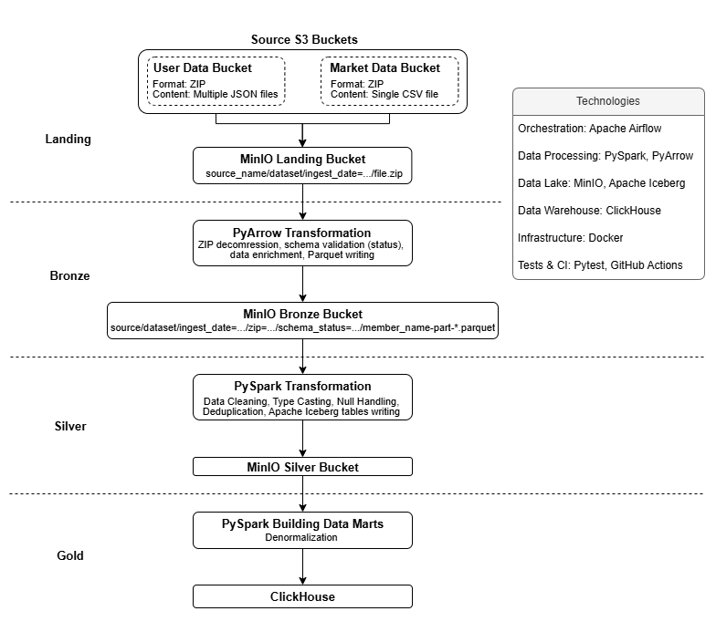

# **ZIP-Data-Pipeline**
This project aims to build a flexible ELT pipeline that ingests data from diverse ZIP files, decompresses them, and builds data marts from the files within them.




## **Tech Stack**
- **Orchestration:** [Apache Airflow](https://airflow.apache.org/).
- **Processing:** [Apache Spark](https://spark.apache.org/docs/latest/) - Large-scale data transformations, [PyArrow](https://arrow.apache.org/docs/python/index.html) - lightweight transformations.
- **Data Lake:** [MinIO](https://docs.min.io/aistor/) + [Apache Iceberg](https://iceberg.apache.org/).
- **Data Warehouse:** [ClickHouse](https://clickhouse.com/).
- **Infrastructure:** [Docker](https://www.docker.com/).
- **Tests & CI:** [Pytest](https://docs.pytest.org/en/stable/), [GitHub Actions](https://docs.github.com/en/actions).

## **Workflow**

### **Sources Configuration**
All data sources are defined declaratively in a single YAML file (`include/settings/sources.yaml`). This is the main interface for adding, disabling, or modifying a source. Each entry configures the data's location, authentication, target DAGs, and dynamic endpoint construction. A single source can feed multiple DAGs independently, and each source is validated individually to ensure that malformed configurations never break the rest of the pipeline.

Read more: 
- [How to define and read sources?](include/ingestion/README.md)

### **Ingestion**
The ingestion layer is represented by a DAG (<code>[ingest_from_s3](dags/ingestion.py)</code>) that extracts data from the S3 bucket, which provides daily data in ZIP format, and saves it to the MinIO landing bucket. There are three main tasks in the ingestion DAG:

1. The first task (`load_sources_config`) loads sources by dag_id from the sources configuration YAML file. It passes the logical_date and dag_id from the context to the parser function (`get_dag_sources`) to retrieve endpoints and other source metadata. It then formats the output as required by the task group (extract_files) to expand the tasks.
   
2. The second task (`wait_for_file`) uses `S3KeySensor` to wait for the endpoint to be available.
   > *Note:* Currently, the `S3KeySensor` uses the "reschedule" mode. On a big scale, it makes sense to consider the "deferrable" mode. The airflow-triggerer is required for this mode, so it has to be defined.

3. The third task (`stream_file`) streams a file from a source S3 bucket into the Landing bucket in chunks using boto3. It also checks the uploaded object's size against the size on the source platform, deletes it if the size mismatches.
   > *Note:* This task can be replaced by `S3CopyObjectOperator` if Amazon S3 is used instead of MinIO.

The second and third tasks are united into the task group (`extract_files`) to create a 1-1 mapping. One instance of this task group is created per source/endpoint combination, so each instance handles exactly one (bucket, key) pair.


### **Bronze (in-progress)**
Airflow spins up a separate container using DockerOperator, passing parameters through an .env file. The script with PyArrow inside decompresses extracted ZIP files in chunks, validates the schema of each file, adds metadata columns (e.g. the ingestion date), and writes the result as Parquet into the Bronze bucket.

This approach was chosen because ZIP files are unsplittable, meaning Apache Spark cannot process a single ZIP file in parallel. By combining Docker and PyArrow instead, the bronze layer achieves fast, lightweight processing while completely avoiding Spark overhead. Decompression in chunks guarantees that any file, regardless of size, can be decompressed.

### **Silver (planned)**
Spark handles splittable Parquet files from the Bronze bucket. It cleans, transforms, and writes them as Apache Iceberg tables into the Silver bucket.

### **Gold (planned)**
Spark handles Apache Iceberg tables from the Silver bucket, builds data marts using denormalization, and loads the result to ClickHouse.

## **Project Structure**

```
.
├── config/
│   └──airflow.cfg
├── dags/
│   └── ingestion.py
├── docker/                          # Custom Dockerfiles and requirements for Airflow, Spark, PyArrow images
├── include/
│   ├── bronze/
│   │   ├── utils/
│   │   ├── bronze_entrypoint.py     # Entrypoint for bronze containers
│   │   └── unarchive_zip.py         # Bronze layer unarchiving logic
│   ├── ingestion/
│   │   ├── config/
│   │   │   ├── ingestion_config.py  
│   │   │   └── sources.yaml         # Interface to define sources
│   │   ├── extract_datasets.py      
│   │   └── read_sources.py          # sources.yaml readers
│   ├── spark_jobs/
│   └── utils/                       # Shared helpers
├── tests/
│   ├── dag_tests/
│   └── unit_tests/
├── .env.example
└── docker-compose.yaml              # Infrastructure setup (Airflow, Spark, MinIO)
```

## Docker Services 
| Service | URL | Login |
| --- | --- | --- |
| Airflow UI | `http://localhost:8080` | `AIRFLOW_USERNAME` / `AIRFLOW_PASSWORD` |
| MinIO Console | `http://localhost:9002` | `AWS_ACCESS_KEY_ID` / `AWS_SECRET_ACCESS_KEY` |
| Spark Master UI | `http://localhost:8090` | — |
| Spark History Server | `http://localhost:18080` | — |

