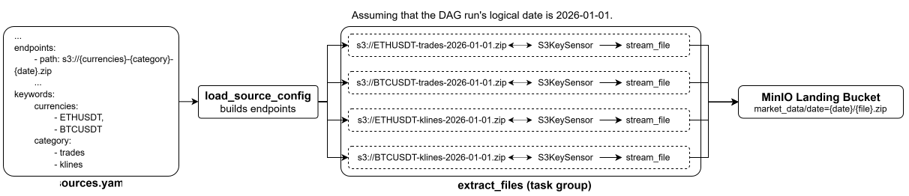
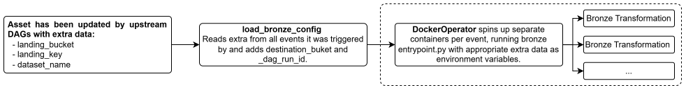
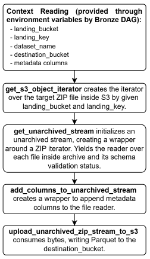

# **ZIP-Data-Pipeline**
The ELT pipeline that ingests ZIP files from S3 buckets, decompresses them, and builds data marts from the files within them.


## **Tech Stack**
- **Orchestration:** [Apache Airflow](https://airflow.apache.org/).
- **Processing:** [Apache Spark](https://spark.apache.org/docs/latest/), [PyArrow](https://arrow.apache.org/docs/python/index.html).
- **Data Lake:** [MinIO](https://docs.min.io/aistor/), [Apache Iceberg](https://iceberg.apache.org/).
- **Data Warehouse:** [ClickHouse](https://clickhouse.com/).
- **Infrastructure:** [Docker](https://www.docker.com/).
- **Tests & CI:** [Pytest](https://docs.pytest.org/en/stable/), [GitHub Actions](https://docs.github.com/en/actions).

## **Workflow**

### **Ingestion**
The ingestion layer is represented by the (<code>[ingest_from_s3](airflow/dags/ingestion.py)</code>) DAG that extracts data from S3 buckets daily, and saves it to the MinIO Landing bucket. 



[All data sources should be defined in a single YAML file](settings/README.md) (`settings/sources.yaml` by default). This is the main interface for adding, modifying, and managing sources. Each entry configures the data's location, authentication, DAGs that allowed to work with the source, and dynamic endpoint construction. A single source can feed multiple DAGs independently, and each source is validated individually to ensure that malformed configurations never break the rest of the pipeline.

<div style="height: 16px;"></div>
There are three tasks in <code>ingest_from_s3</code>. The second and third tasks are combined into the task group (`extract_files`) to create a 1-1 mapping. One instance of this task group is created per source/endpoint combination, so each instance handles exactly one (bucket, key) pair:

1. The first task (`load_sources_config`) loads formatted sources by dag_id from the sources configuration YAML file. The date is passed as ds (the DAG logical date).  

2. The second task (`wait_for_file`) uses `S3KeySensor` to wait for the endpoint to be available.

3. The third task (`stream_file`) streams a file from a source S3 bucket into the Landing bucket in chunks using boto3. It also checks the uploaded object's size against the size on the source platform, deletes it if the size mismatches. Builds the following landing key: `bucket/source_name/dataset_name/date=year-month-day/file_name`.
   > *Note:* This task can be replaced by `S3CopyObjectOperator` if AWS S3 is used instead of MinIO.

<div style="height: 16px;"></div>

### **Bronze (in-progress)**
The main goal of Bronze layer is to decompress raw extracted ZIP files in chunks and load them into the Bronze bucket as Parquet. Bronze transformation runs on PyArrow, in a dedicated Docker container.
This approach was chosen because ZIP files are unsplittable, so Spark cannot split and process a single ZIP file across its cluster. By combining Docker and PyArrow instead, the bronze layer achieves fast, lightweight processing while completely avoiding Spark overhead. Decompression in chunks guarantees that any file, regardless of size, can be decompressed.

#### **The bronze_zip_to_parquet DAG**


The [Bronze DAG](airflow/dags/bronze.py) uses Asset-Aware Scheduling, triggering automatically whenever the Landing asset is updated. There are two tasks, and the second is dynamically mapped so that each triggering asset event is processed independently:

1. The first task (load_bronze_config) reads the triggering asset events for the Landing asset out of the task context and builds one environment-variable dictionary per landed file, containing the landing bucket, landing key, dataset name, destination (Bronze) bucket, and the DAG run id.
2. The second task (bronze_transformation) is a dynamically mapped DockerOperator that spins up one Docker container per config entry produced by the first task, passing each dictionary in as environment variables. Each container runs the bronze entrypoint module, decompresses the corresponding ZIP file in chunks, validates its schema, adds metadata columns, and writes the result as Parquet into the Bronze bucket (read the next part for more details). Containers run on the default docker-compose network.

#### **Bronze Transformation**
<p>Each container runs through <a href="./src/bronze/entrypoint.py">bronze entrypoint</a>. Bronze transformation can be divided into the following steps:</p>

<table>
  <tr>
    <td width="300" valign="top">
      
    </td>
    <td valign="top">
      <b>1. Context Reading.</b>
      <p>The following environment variables are read:</p>
      <ul>
        <li><code>landing_bucket</code> – the bucket with the target ZIP file.</li>
        <li><code>landing_key</code> – the target ZIP file key inside landing_bucket.</li>
        <li><code>dataset_name</code> – is used to fetch an expected schema for the files inside the target ZIP file, which is represented by a pyarrow.Schema object.</li>
        <li><code>destination_bucket</code> – the bucket to write final Parquet files.</li>
      </ul>
      <p>The metadata columns' values are built as pyarrow.scalar:</p> 
      <ul> 
        <li><code>_dag_run_id</code> – the Bronze DAG run_id, which is passed by the DAG as an environment variable. 
        <li><code>_bronze_processed_at</code> – the timestamp in milliseconds</li>
        <li><code>_zip_file_name</code> – the name of the target ZIP file that is processed.</li>
      </ul>
      <p><b>2. get_s3_object_iterator:</b> Creates an iterator over the target ZIP file inside S3 by given landing_bucket and landing_key using boto3 client.</p>
      <p><b>3. get_unarchived_stream:</b> Takes an iterator and an expected schema. Initializes an unarchived stream, creating a wrapper around a ZIP iterator that unarchives files inside the ZIP archive in chunks. Dynamically resolves the pyarrow function and its arguments to read raw unarchived bytes by the file type (all unsupported files are skipped). The expected schema applies during this reading. For all matching fields, the data types from the expected schema are applied (pyarrow.string for all fields - convention). If there are unexpected fields in the file, the behavior depends on the file type. For CSV files, all unexpected fields are converted to pyarrow.string, while for JSON files pyarrow infers the data types of unexpected fields.</p>
      <p><b>4. add_columns_to_unarchived_stream:</b> Creates a wrapper to append the metadata columns from the context to each chunk of the iterator. Maps each pyarrow.scalar by the number of rows inside a chunk and appends it as a new column.</p>
      <p><b>5. upload_unarchived_zip_stream_to_s3:</b> Builds a target key under which the decompressed file is uploaded to the destination_bucket. The bronze keys use verification status by convention: <code>source_name/dataset_name/date=.../status=.../file_name/part-*.parquet</code>. The status is resolved by schema comparison. It compares every field in the file schema against the expected schema (including JSON nested structures). Once the key is built, it writes chunks as Parquet files to the destination_bucket under this key.</p>
    </td>
  </tr>
</table>


### **Silver (planned)**
Spark handles splittable Parquet files from the Bronze bucket. It cleans, transforms, and writes them as Apache Iceberg tables into the Silver bucket.

<div style="height: 16px;"></div>

### **Gold (planned)**
Spark handles Apache Iceberg tables from the Silver bucket, builds data marts using denormalization, and loads the result to ClickHouse.

<div style="height: 16px;"></div>

## **Project Structure**

```
.
├── airflow/
│   ├── config/
│   ├── dags/
│   │   └── ingestion.py
│   └── logs/
├── settings/
│   ├── README.md
│   ├── pipeline_config.py
│   ├── sources.yaml
│   └── dataset_schemas.yaml
├── docker/                              # Custom Dockerfiles and image requirements
├── src/
│   ├── bronze/
│   │   ├── io_wrapper.py
│   │   ├── read_dataset_schema.py
│   │   ├── bronze_entrypoint.py         # Entrypoint for bronze containers
│   │   └── unarchive_zip.py             # Bronze layer unarchiving logic
│   ├── ingestion/
│   │   ├── upload_datasets.py
│   │   └── read_sources.py              # sources.yaml readers
│   ├── spark_jobs/
│   └── utils/                           # Shared helpers
        └── build_layer_key.py                           
├── tests/
│   ├── dag_tests/
│   ├── integration_tests/
│   └── unit_tests/
├── .env.example
└── docker-compose.yaml                  # Infrastructure setup
```

## Docker Services 
| Service | URL | Login |
| --- | --- | --- |
| Airflow UI | `http://localhost:8080` | `AIRFLOW_USERNAME` / `AIRFLOW_PASSWORD` |
| MinIO Console | `http://localhost:9002` | `AWS_ACCESS_KEY_ID` / `AWS_SECRET_ACCESS_KEY` |
| Spark Master UI | `http://localhost:8090` | — |
| Spark History Server | `http://localhost:18080` | — |

