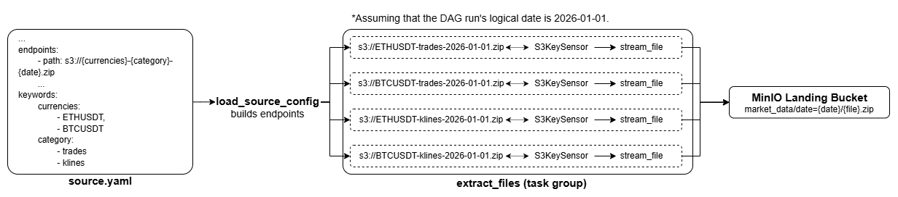

# **ZIP-Data-Pipeline**
The ELT pipeline that ingests ZIP files from S3 buckets, decompresses them, and builds data marts from the files within them.


## **Tech Stack**
- **Orchestration:** [Apache Airflow](https://airflow.apache.org/).
- **Processing:** [Apache Spark](https://spark.apache.org/docs/latest/), [PyArrow](https://arrow.apache.org/docs/python/index.html).
- **Data Lake:** [MinIO](https://docs.min.io/aistor/), [Apache Iceberg](https://iceberg.apache.org/).
- **Data Warehouse:** [ClickHouse](https://clickhouse.com/).
- **Infrastructure:** [Docker](https://www.docker.com/).
- **Tests & CI:** [Pytest](https://docs.pytest.org/en/stable/), [GitHub Actions](https://docs.github.com/en/actions).

## **Workflow**

### **Ingestion**
The ingestion layer is represented by a DAG (<code>[ingest_from_s3](airflow/dags/ingestion.py)</code>) that extracts data from S3 buckets daily, and saves it to the MinIO Landing bucket. 



All data sources should be defined in a single YAML file (`settings/sources.yaml` by default). This is the main interface for adding, modifying, and managing sources. Each entry configures the data's location, authentication, DAGs that allowed to work with the source, and dynamic endpoint construction. A single source can feed multiple DAGs independently, and each source is validated individually to ensure that malformed configurations never break the rest of the pipeline.

Read more: 
- [How to define and read sources?](settings/README.md)
<div style="height: 16px;"></div>
There are three tasks in <code>ingest_from_s3</code>. The second and third tasks are combined into the task group (`extract_files`) to create a 1-1 mapping. One instance of this task group is created per source/endpoint combination, so each instance handles exactly one (bucket, key) pair:

1. The first task (`load_sources_config`) loads formatted sources by dag_id from the sources configuration YAML file. The date is passed as ds (the DAG logical date).  

2. The second task (`wait_for_file`) uses `S3KeySensor` to wait for the endpoint to be available.

3. The third task (`stream_file`) streams a file from a source S3 bucket into the Landing bucket in chunks using boto3. It also checks the uploaded object's size against the size on the source platform, deletes it if the size mismatches. Builds the following landing key: `bucket/source_name/dataset_name/date=year-month-day/file_name`.
   > *Note:* This task can be replaced by `S3CopyObjectOperator` if AWS S3 is used instead of MinIO.

<div style="height: 16px;"></div>

### **Bronze (in-progress)**
Airflow spins up a separate container using DockerOperator, passing parameters through the .env file. The script with PyArrow inside decompresses extracted ZIP files in chunks (the entire file is never landed in the buffer), validates the schema of each file, adds metadata columns (`_bronze_processed_at`, `_dag_run_id`, `_zip_file`, `_source_file_name`), and writes the result as Parquet into the Bronze bucket in parts.

This approach was chosen because ZIP files are unsplittable, meaning Apache Spark cannot process a single ZIP file in parallel. By combining Docker and PyArrow instead, the bronze layer achieves fast, lightweight processing while completely avoiding Spark overhead. Decompression in chunks guarantees that any file, regardless of size, can be decompressed.

<div style="height: 16px;"></div>

### **Silver (planned)**
Spark handles splittable Parquet files from the Bronze bucket. It cleans, transforms, and writes them as Apache Iceberg tables into the Silver bucket.

<div style="height: 16px;"></div>

### **Gold (planned)**
Spark handles Apache Iceberg tables from the Silver bucket, builds data marts using denormalization, and loads the result to ClickHouse.

<div style="height: 16px;"></div>

## **Project Structure**

```
.
├── airflow/
│   ├── config/
│   ├── dags/
│   │   └── ingestion.py
│   └── logs/
├── settings/
│   ├── README.md
│   ├── pipeline_config.py
│   ├── sources.yaml
│   └── dataset_schemas.yaml
├── docker/                              # Custom Dockerfiles and image requirements
├── scripts/
│   ├── bronze/
│   │   ├── io_wrapper.py
│   │   ├── read_dataset_schema.py
│   │   ├── bronze_entrypoint.py         # Entrypoint for bronze containers
│   │   └── unarchive_zip.py             # Bronze layer unarchiving logic
│   ├── ingestion/
│   │   ├── extract_datasets.py
│   │   └── read_sources.py              # sources.yaml readers
│   ├── spark_jobs/
│   └── utils/                           # Shared helpers
        └── build_layer_key.py                           
├── tests/
│   ├── dag_tests/
│   ├── integration_tests/
│   └── unit_tests/
├── .env.example
└── docker-compose.yaml                  # Infrastructure setup
```

## Docker Services 
| Service | URL | Login |
| --- | --- | --- |
| Airflow UI | `http://localhost:8080` | `AIRFLOW_USERNAME` / `AIRFLOW_PASSWORD` |
| MinIO Console | `http://localhost:9002` | `AWS_ACCESS_KEY_ID` / `AWS_SECRET_ACCESS_KEY` |
| Spark Master UI | `http://localhost:8090` | — |
| Spark History Server | `http://localhost:18080` | — |

