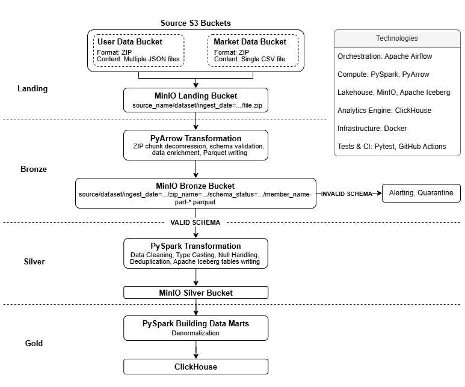
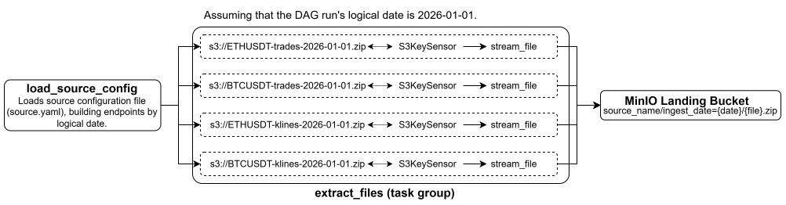
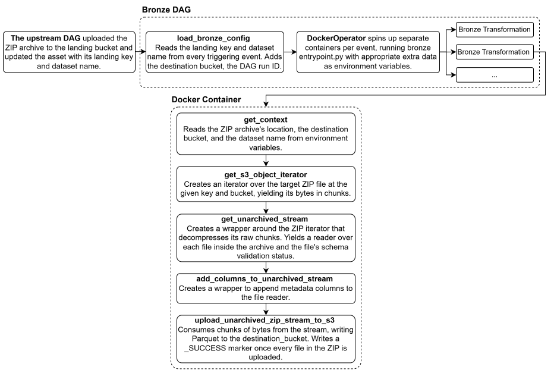

# **ZIP-Data-Pipeline**
| Category | Badges |
| :--- | :--- |
| **Build & DevOps** | [](https://github.com/IliaTimchuk/ZIP-Data-Pipeline/actions/workflows/ci.yaml)   |
| **Orchestration & Compute** |    |
| **Storage** |   |
| **Analytics Engine** |  |

<p>ZIP-Data-Pipeline is an end-to-end ELT pipeline that turns ZIP archives from external S3 buckets into analytics-ready data marts in ClickHouse through a layered data lakehouse architecture.</p>



## **Why this project exists**
<p>ZIP archives are one of the most common ways to publish bulk data and one of the least convenient to process. They cannot be split for parallel processing, their file index sits at the end of the archive, and one archive often contains different file formats.</p>

<p>ZIP-Data-Pipeline turns such archives into reliable, analytics-ready data:</p>

- Archives of any size are processed without being loaded into memory.
- Files that do not match the expected schema are kept separately instead of being dropped.
- Re-running the pipeline never duplicates data.
- Downstream layers read only archives that were fully processed.
- Every row can be traced back to its archive, source file, and pipeline run.
- New data sources are added through configuration, without code changes.

<p>The pipeline follows the medallion architecture: Landing keeps raw data, Bronze turns raw archives into validated Parquet, Silver cleans the data into Apache Iceberg tables, and Gold builds and publishes data marts to ClickHouse.</p>

## **Workflow and main engineering decisions**

### **Ingestion**
The ingestion layer is represented by the <code>[ingest_from_s3](airflow/dags/ingestion.py)</code> DAG that extracts data from S3 buckets daily and saves it to the MinIO Landing bucket.



| Decision | Why |
| --- | --- |
| All sources are defined in one YAML [configuration file](settings/README.md) with templated endpoints (e.g. `{symbol}-trades-{date}.zip`). | A new source or dataset can be added without code changes, and one entry can expand into many files. |
| Each source in the source configuration is validated separately; malformed sources are skipped and reported by email. | One malformed entry does not stop ingestion for all other sources. |
| One mapped task group per source/endpoint pair. | Every file is waited for, retried and monitored independently, and one failing file does not block the others. |
| `S3KeySensor` in `reschedule` mode, checking hourly for up to 24 hours. | Source files are published at unknown times, and rescheduling frees the worker slot between checks. |
| The uploaded size is compared with the source size, and the object is deleted on mismatch. | A truncated file never reaches Bronze. |
| Landing keys are partitioned as `source/dataset/ingest_date=.../file` using the DAG run's logical date. | A re-run for the same date overwrites the same key instead of creating a duplicate. |
| boto3 streaming instead of `S3CopyObjectOperator`. | `S3CopyObjectOperator` uses server-side copy, which works only within one S3 service, while the source bucket and MinIO are different services. |
| `stream_file` writes a Landing asset event with the bucket, key and dataset as extra event data. | Bronze starts for files as soon as they land, without its own schedule or polling. |

<div style="height: 16px;"></div>

### **Bronze**
<p>The Bronze layer turns each landed ZIP into validated Parquet files in the Bronze bucket.</p>
<p>The Bronze DAG is triggered by Landing asset events and starts one Docker container per landed ZIP. Inside each container, the ZIP goes through the <a href="./src/bronze/">Bronze Transformation</a>: it is streamed from the landing bucket, decompressed file by file, checked against the expected schema, enriched with lineage columns and written to Bronze as Parquet.</p>



| Decision | Why |
| --- | --- |
| Each ZIP is streamed from S3 and decompressed file by file in chunks with PyArrow, in its own Docker container instead of Spark. | ZIP files are unsplittable, so Spark cannot process one archive in parallel. One lightweight container per ZIP gives parallelism across archives without Spark's overhead, and streaming keeps memory use independent of the archive size. |
| All CSV data and JSON numeric data are read as strings. | Keeping data as strings avoids type inference losing data. If a cast rule changes, Silver can re-cast from Bronze without decompressing the ZIP archives again. |
| Each file is validated against the expected schema and written under `schema_status=valid` or `schema_status=invalid`. Invalid files are kept in quarantine instead of being dropped, and an alert is sent for them. | Silver and Gold expect an exact schema. A mismatching file could fail their jobs or be processed silently and put wrong data into the data marts. Quarantine keeps such files out of the valid path, loses no data, and lets them be reprocessed once the schema is updated. |
| Empty files inside a ZIP archive are skipped, while a file that cannot be parsed fails the transformation of the entire archive. | An empty file does not throw an exception, while wrong data are never discarded silently. |
| The key of the ZIP archive within the destination bucket is cleaned before writing the data. | Re-runs of the transformation never duplicate data. |
| A `_SUCCESS` marker is written under the key of the ZIP archive as the last step of the transformation. | The marker confirms that the transformation of the entire archive was completed. If the transformation is interrupted, the marker is never written, so Silver can distinguish complete ZIP archives from partial ones. |
| Lineage columns are added to every row: DAG run id, processing time, ZIP name, source file name and schema status. | Every row can be traced back to its archive, file and pipeline run. |
| CSV files are read in chunks, while each JSON file is loaded into memory entirely, up to a configured size limit (8 MB by default). A JSON file above the limit fails the transformation of the entire archive. | PyArrow's JSON reader supports only newline-delimited JSON, while source files may contain a single object or an array of records. The size limit protects the container's memory from unexpectedly large JSON files. |
| Parquet files and row groups are sized for Spark (files of ~128–512 MB, row groups of ~64–128 MB). | Silver's Spark jobs can split large files on row-group boundaries. |


### **Silver (in progress)**
Spark handles splittable Parquet files from the Bronze bucket. It cleans, transforms, and writes them as Apache Iceberg tables into the Silver bucket.

<div style="height: 16px;"></div>

### **Gold (planned)**
Spark handles Apache Iceberg tables from the Silver bucket, builds data marts using denormalization, and loads the result into ClickHouse.

<div style="height: 16px;"></div>

## **Project Structure**

```
.
├── airflow/
│   ├── config/                          # airflow.cfg 
│   ├── dags/
│   │   ├── bronze.py                    # Bronze layer DAG
│   │   └── ingestion.py                 # Ingestion DAG
│   └── logs/
├── docker/                              # Custom Dockerfiles and image requirements
├── settings/
│   ├── schemas/
│   │   └── bronze_schemas.py            # Bronze layer schema definitions
│   ├── README.md
│   ├── airflow_assets.py                # Airflow asset definitions
│   ├── pipeline_config.py               # Main project configurations
│   └── sources.yaml
├── src/
│   ├── bronze/
│   │   ├── context.py                   # Bronze run context
│   │   ├── entrypoint.py                # Entrypoint for bronze containers
│   │   ├── io_wrapper.py                # File-like wrapper for iterators
│   │   ├── readers.py                   # Unarchived files readers
│   │   └── unarchive_zip.py             # ZIP decompression logic
│   ├── ingestion/
│   │   ├── read_sources.py              # sources.yaml readers
│   │   └── upload_dataset.py
│   ├── spark_jobs/
│   └── utils/                           # Shared helpers
│       └── build_layer_key.py
├── tests/
│   ├── dag_tests/
│   ├── integration_tests/
│   └── unit_tests/
└── docker-compose.yaml                  # Infrastructure setup
```

## **Docker Services**
| Service | URL | Login |
| --- | --- | --- |
| Airflow UI | `http://localhost:8080` | `AIRFLOW_USERNAME` / `AIRFLOW_PASSWORD` |
| MinIO Console | `http://localhost:9002` | `AWS_ACCESS_KEY_ID` / `AWS_SECRET_ACCESS_KEY` |
| Spark Master UI | `http://localhost:8090` | — |
| Spark History Server | `http://localhost:18080` | — |

