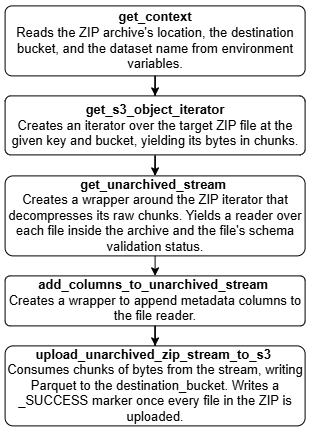

#### **Bronze Transformation**
Each container runs through the bronze entrypoint. Bronze transformation can be divided into the following steps:

  

**1. Context Reading.** The following environment variables are read:

- `LANDING_BUCKET` – the bucket with the target ZIP file.
- `LANDING_KEY` – the target ZIP file key inside `LANDING_BUCKET`.
- `DATASET_NAME` – used to look up the expected schema (a `pyarrow.Schema` object) for the files inside the target ZIP file.
- `DESTINATION_BUCKET` – the bucket to write final Parquet files.
- `AWS_ENDPOINT` (optional) – the S3 endpoint URL, for example a MinIO address.

The values of the metadata columns are also built here. They are added to every file in the ZIP in step 4:

- `_dag_run_id` – the Bronze DAG `run_id`, which is passed by the DAG as an environment variable.
- `_bronze_processed_at` – the UTC time when the columns were built, in milliseconds.
- `_zip_file_name` – the name of the target ZIP file, taken from `LANDING_KEY`.

**2. `get_s3_object_iterator`:** Creates an iterator over the target ZIP file inside S3 for the given `LANDING_BUCKET` and `LANDING_KEY` using a boto3 client. The iterator returns the object in 16 MB chunks, so the ZIP file is never downloaded as a whole.

**3. `get_unarchived_stream`:** Initializes an unarchived stream, creating a wrapper around the iterator over a ZIP file. It yields a reader for each file inside the archive together with the file's schema validation status.

Processes the archive in chunks without loading it into memory. Each decompressed file is wrapped into a file-like object and opened by its extension as a `pyarrow.RecordBatchReader`. Files with unsupported extensions and files without data are skipped with a warning, while a file that cannot be parsed fails the container. The reader depends on the file type:

- `CSV` – streamed in chunks. Every column is read as string. A file that PyArrow reports as empty is skipped.
- `JSON` – loaded fully into memory. A file larger than `MAX_JSON_SIZE_BYTES` fails the container. A single JSON object is read as one record. A file that is empty or has no records with data (`{}`, `[]`, `[{}]`) is skipped. All numeric data is read as string, nested structures stay nested.

The file schema is then compared with the expected schema. They must be identical: the same field names, order and types, including nested JSON structures. The status is `valid` if they match and `invalid` otherwise. Invalid files are not dropped, they are written under a separate `schema_status=invalid` key.

**4. `add_columns_to_unarchived_stream`:** Creates a wrapper to append the metadata columns to each batch of the reader. Each value is repeated for every row of the batch. Besides the three columns from step 1, it adds `_source_file_name` (the name of the file inside the ZIP) and `_schema_status` as a column.

**5. <code>upload_unarchived_zip_stream_to_s3</code>:** Uploads the decompressed files as Parquet to the <code>DESTINATION_BUCKET</code>. All the output of a ZIP lives under its bronze key, split by the validation status from step 3:

<code>source_name/dataset_name/ingest_date=.../zip_name={zip_stem}/schema_status=.../{member_file_name}_part-*.parquet</code>

where <code>zip_stem</code> is the ZIP file name without the extension and <code>member_file_name</code> is the path of the file inside the ZIP, including its extension, with <code>/</code> replaced by <code>__</code> (for example, <code>data/trades.csv</code> becomes <code>data__trades.csv_part-0.parquet</code>). The row limits are in <code>pipeline_config.py</code>.

Before writing, the bronze key of the ZIP is wiped (the <code>_SUCCESS</code> marker first), so a re-run never produces duplicates. Once all files are written, an empty <code>zip_name={zip_stem}/_SUCCESS</code> marker shows that the ZIP was fully transformed. A ZIP without files with data writes nothing, not even the marker. Because the key is wiped first, a re-run of such a ZIP also deletes the output of the previous run.
